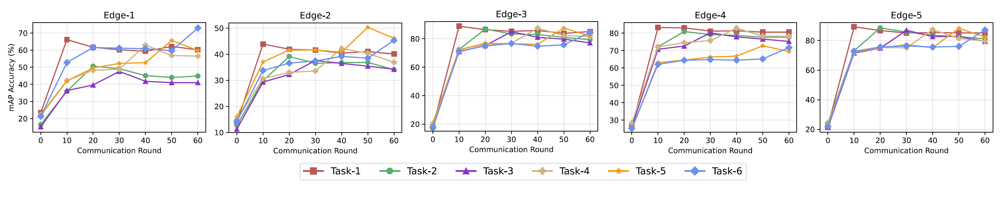

# Federated Lifelong Person Re-identification

This repository contains the Official PyTorch implementation for the Paper ["Spatial-Temporal Federated Learning for Lifelong Person Re-identification on Distributed Edges"](https://arxiv.org/abs/2207.11759) by [Lei Zhang](https://github.com/MagicDevilZhang/), [Guanyu Gao](https://github.com/GuanyuGao) and [Huaizheng Zhang](https://huaizhengzhang.github.io/).

- [2023.06.01] Our [paper](https://ieeexplore.ieee.org/document/10142016) is accepted to IEEE Transactions on Circuits and Systems for Video Technology.

## Abstract

Data drift is a thorny challenge when deploying person re-identification (ReID) models into real-world devices, where the data distribution is significantly different from that of the training environment and keeps changing. To tackle this issue, we propose a federated spatial-temporal incremental learning approach, named FedSTIL, which leverages both lifelong learning and federated learning to continuously optimize models deployed on many distributed edge clients. Unlike previous efforts, FedSTIL aims to mine spatial-temporal correlations among the knowledge learnt from different edge clients. Extensive experiments on a mixture of five real-world datasets demonstrate that our method outperforms others by nearly 4% in Rank-1 accuracy, while reducing communication cost by 62%.  

## Quick Start

1. Please install all dependencies from `requirements.txt` after creating your own python environment with `python >= 3.8.0`.

```shell
$ pip3 install -r requirements.txt
```

2. Download our prepared simple [person re-identification datasets](https://drive.google.com/file/d/10NDQy0IZXupqXBhKfm3j7SwF08JBrE-w/view?usp=sharing), and then unzip on the project root path.  

```shell
$ tar -zxvf preprocessed_shuffle.tar.gz
```

Alternatively, you can organize your own dataset for test, please follow the structure of our dataset or use our build tool. The dataset build tools will be published soon.

3. If you have multiple GPUs, please configure in `./configs/common.json` 

```yaml
device:
  - cuda:0
  - cuda:1
  - cuda:2
  - cuda:3
  - cuda:4
```

4. Startup the experiments in `./configs/basis_exp/experiment_fedstil.yaml`

```shell
$ python3 main.py --experiments ./configs/basis_exp/experiment_fedstil.yaml
```

## Results

All clients and server will save the checkpoints of model parameters and communication content on the `./ckpts/`. The log files for each experiment is on the `./logs/`, which include experimental settings, and training & evaluation performances. 

We also provide the analyze tools on the package `./analyse/`. Those tools may help you analyze the accuracy, forgetting, and visualization.



## Playground

We have prepared various experiment settings for our given datasets, you can find them in `./configs/`. You can also set up your own experiment by following the format of given configurations.

```yaml
# Set your experiment name and the method for calling.
# The available methods are recorded at './methods/__init__.py'.
exp_name: 
exp_method: 

# Model configuration for experiement. 
model_opts:
  # The available models are prepared at './models/__init__.py'.
  name: 
  # Some of the initial hyper-parameters can be customed like:
  ## num_classes: 8000
  
  # Determine layers of the model for trainining.
  fine_tuning:
    # Layers for training, for instance:
    ## - base.layer4
    ## - classifier

# Server configuration for experiement. 
server:
  server_name: 
  # Some of the hyper-parameters can be customed like:
  ## distance_calculate_step: 10
  ## distance_calculate_decay: 0.8

# Configuration for all distributed clients. 
clients:
  # You can setup multi clients by following: 
  - client_name: 
    # The task stream for sequential local continual learning, the task name should exists in './configs/common.yaml -> datasets_dir' directory.
    tasks: # [task-0-0, task-0-1, ...]
```

Besides, you can also design your federated lifelong learning method by following the template `./methods/baseline.py`, and remember to add the method into `./methods/__init__.py`.

## Contributing

Pull requests are more than welcome! If you have any questions please feel free to contact us.

## Citation

Our paper is available on [Arxiv](https://arxiv.org/abs/2207.11759) and [IEEE TCSVT](https://ieeexplore.ieee.org/document/10142016). If you use this for research, please cite.

```bibtex
@article{zhang2022flreid,
   title = {Spatial-Temporal Federated Learning for Lifelong Person Re-identification on Distributed Edges},
   author = {Lei Zhang and Guanyu Gao and Huaizheng Zhang},
   journal={arXiv preprint arXiv:2207.11759},
   year = {2022},
}
```

## License

Copyright 2022, MSNLAB, NJUST SCE

Licensed under the Apache License, Version 2.0 (the "License"); you may not use this file except in compliance with the License. You may obtain a copy of the License at

https://www.apache.org/licenses/LICENSE-2.0

Unless required by applicable law or agreed to in writing, software distributed under the License is distributed on an "AS IS" BASIS, WITHOUT WARRANTIES OR CONDITIONS OF ANY KIND, either express or implied. See the License for the specific language governing permissions and limitations under the License.

